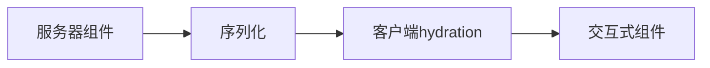

# 深入理解 React Server Components

React Server Components (RSC) 是 React 生态系统中的一项革命性技术。本文将深入探讨其工作原理和实践应用。

## 1. RSC 简介

React Server Components 允许我们在服务器端渲染 React 组件，同时保持客户端的交互性。这不同于传统的服务器端渲染 (SSR)。

### 1.1 主要特点

- 零客户端 JavaScript 包大小
- 直接访问后端资源
- 自动代码分割
- 流式渲染

## 2. 工作原理

### 2.1 组件类型

```typescript
// 服务器组件
async function BlogList() {
  const posts = await db.posts.findMany();

  return (
    <div>
      {posts.map(post => (
        <BlogPost key={post.id} post={post} />
      ))}
    </div>
  );
}

// 客户端组件
'use client';

function LikeButton({ postId }) {
  const [liked, setLiked] = useState(false);

  return (
    <button onClick={() => setLiked(!liked)}>
      {liked ? '已点赞' : '点赞'}
    </button>
  );
}
```

### 2.2 数据流

RSC 的数据流是单向的，从服务器到客户端：



## 3. 性能优化

### 3.1 选择性 Hydration

RSC 允许我们选择性地对组件进行 hydration，这意味着：

```typescript
// 这个组件在服务器上运行，不会增加客户端 bundle 大小
async function ExpensiveDataFetch() {
  const data = await fetchLargeDataset();
  return <DataDisplay data={data} />;
}

// 只有这部分需要在客户端 hydrate
'use client';
function DataDisplay({ data }) {
  const [filter, setFilter] = useState('all');
  // ...
}
```

### 3.2 缓存策略

```typescript
// 使用 React 缓存
import { cache } from "react";

const getUser = cache(async (id: string) => {
  const user = await db.user.findUnique({ where: { id } });
  return user;
});
```

## 4. 最佳实践

### 4.1 组件分割原则

- 将数据获取逻辑放在服务器组件中
- 将交互逻辑放在客户端组件中
- 使用 props 传递数据

### 4.2 错误处理

```typescript
async function UserProfile({ userId }) {
  try {
    const user = await getUser(userId);
    return <ProfileDisplay user={user} />;
  } catch (error) {
    return <ErrorBoundary error={error} />;
  }
}
```

## 5. 性能对比

| 渲染方式 | 首次加载 | TTI  | Bundle Size |
| -------- | -------- | ---- | ----------- |
| CSR      | 慢       | 慢   | 大          |
| SSR      | 快       | 中等 | 中等        |
| RSC      | 快       | 快   | 小          |

## 6. 实际应用案例

### 6.1 大规模数据展示

```typescript
// 服务器组件处理数据获取和过滤
async function DataGrid({ query }) {
  const data = await fetchLargeDataset(query);
  const filtered = filterData(data);

  return (
    <div>
      <ClientPagination
        data={filtered}
        itemsPerPage={20}
      />
    </div>
  );
}

// 客户端组件处理交互
'use client';
function ClientPagination({ data, itemsPerPage }) {
  const [page, setPage] = useState(1);
  // 分页逻辑...
}
```

## 7. 注意事项

1. 不要在服务器组件中使用：

   - useState
   - useEffect
   - 浏览器 API

2. 正确使用 'use client' 指令
3. 合理规划组件边界

## 8. 未来展望

RSC 仍在不断发展中，未来可能会有：

- 更好的缓存控制
- 更多的内置优化
- 更好的开发工具支持

## 9. 总结

React Server Components 代表了现代 Web 开发的一个重要方向，它通过智能的服务器端渲染和选择性客户端激活，为我们提供了构建高性能 Web 应用的新方法。

---

> 参考资料：
>
> 1. [React 官方文档](https://react.dev)
> 2. [RFC: React Server Components](https://github.com/reactjs/rfcs/blob/main/text/0188-server-components.md)
